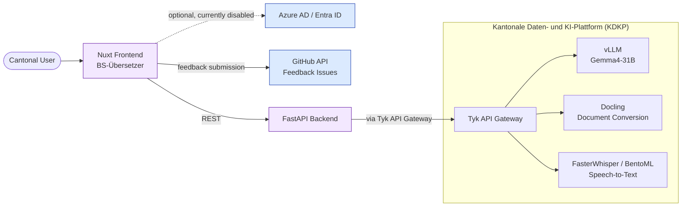

# BS-Übersetzer

BS-Übersetzer is an AI translation tool for cantonal staff, supporting text, documents, and spoken input across 50+ languages.

## What it does

- **Intelligent Translation** AI-powered translation between 50+ languages with automatic source-language detection
- **Tone & Style Control** formal, informal, technical, creative, or concise tone
- **Domain-Specific Translation** specialized handling for legal, medical, technical, financial, and other domains
- **File Conversion** translate whole documents (TXT, DOCX, PPTX, XLSX, PDF, HTML, RTF, Markdown)
- **Custom Glossary** personal terminology list for consistent translations
- **Voice Input** dictate source text via speech-to-text
- **Document Export** download translations as Word documents
- **Conversation Mode** Google Translate-style chat interface for back-and-forth translation of short text snippets

Available in German and English.

## Interfaces & Integration

| What | Description |
|---|---|
| **Authentication** | No authentication currently enabled; the app supports Azure AD (Entra ID) SSO but currently runs in no-auth mode |
| **Progressive Web App** | Full PWA; installable with offline support |
| **Microsoft Teams** | Not integrated |
| **IT BS Unternehmensportal App Store** | Available |
| **KDKP APIs used** | LLM inference (vLLM, Gemma4-31B), Docling (document conversion), speech-to-text (FasterWhisper / BentoML) |

## Source Code

- Frontend: [github.com/DCC-BS/bs-translator-frontend](https://github.com/DCC-BS/bs-translator-frontend)
- Backend: [github.com/DCC-BS/bs-translator-backend](https://github.com/DCC-BS/bs-translator-backend)

## Architecture Overview

