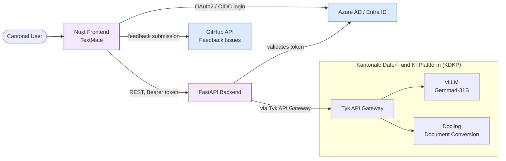

# TextMate

TextMate is an AI writing assistant for cantonal staff. It helps rewrite, proofread, and validate German-language text against Basel-Stadt's official style guides and writing conventions.

## What it does

- **Text Rewriting** rewrite text with a chosen style, audience, and intent
- **Document Advisor** validates a text against selected reference documents (e.g. cantonal style guides) and flags deviations, with a PDF preview of the source
- **Quick Actions** one-click transformations: summarize, bullet points, adjust formality, plain language, social media format, proofread, character speech, and custom prompts
- **Document Conversion** import PDF/DOCX documents for editing

Available in German and English.

## Interfaces & Integration

| What | Description |
|---|---|
| **Authentication** | Azure AD (Entra ID) SSO; enabled in production |
| **Progressive Web App** | Installable icon (manifest) only; no offline support/service worker |
| **Microsoft Teams** | Pinned as a Teams tab for cantonal staff |
| **IT BS Unternehmensportal App Store** | Available |
| **KDKP APIs used** | LLM inference (vLLM, Gemma4-31B), Docling (document conversion) |

## Source Code

- Frontend: [github.com/DCC-BS/text-mate-frontend](https://github.com/DCC-BS/text-mate-frontend)
- Backend: [github.com/DCC-BS/text-mate-backend](https://github.com/DCC-BS/text-mate-backend)

## Local Development

TextMate is driven entirely through **mise**. After `mise trust`, run
`mise run install` to install dependencies and prepare the environment, then
`mise run dev` to start the Nuxt dev server.

E2E tests use Playwright. The browser binaries are installed via the
`playwright:install-browser` task, and the required OS-level libraries are
declared as `[bootstrap.packages]` and applied with `mise bootstrap packages apply`.
See the [mise guide](/dev-setup/mise#playwright-browser-setup) for details.

## Architecture Overview

