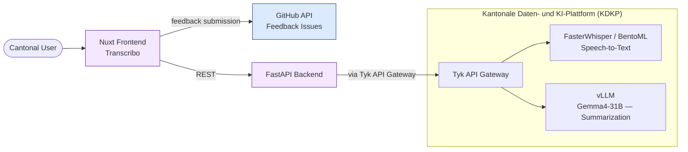

# Transcribo

Transcribo is a web application for transcribing and editing audio and video recordings, with speaker diarization and AI-generated summaries.

## What it does

- **Audio/Video Transcription** upload media files and generate accurate transcriptions
- **Speaker Diarization** identify and separate different speakers in a recording
- **AI Speaker Inference** identify speaker names from context
- **Timeline Editor** visual timeline with speaker labels for precise segment editing
- **Smart Editor** learns from user edits to improve future transcriptions
- **Real-time Editing** edit transcription text with live preview and validation
- **AI Summarization** generate a summary of the transcribed text
- **AI Title Inference** identify speaker names from context
- **AI Keyword Correction** keywords are identified and corrected as a post-processing step
- **Export Options** export as plain text or SRT subtitle files
- **Audio Recording** record audio directly in the app
- **Undo/Redo** full command-based undo/redo support

Available in German and English.

## Interfaces & Integration

| What | Description |
|---|---|
| **Authentication** | No authentication layer |
| **Progressive Web App** | Full PWA; installable with offline support |
| **Microsoft Teams** | Not integrated |
| **IT BS Unternehmensportal App Store** | Available |
| **KDKP APIs used** | Speech-to-text (FasterWhisper / BentoML), LLM inference (vLLM, Gemma4-31B) for summarization |

## Source Code

- Frontend: [github.com/DCC-BS/transcribo-frontend](https://github.com/DCC-BS/transcribo-frontend)
- Backend: [github.com/DCC-BS/transcribo-backend](https://github.com/DCC-BS/transcribo-backend)

## Architecture Overview

