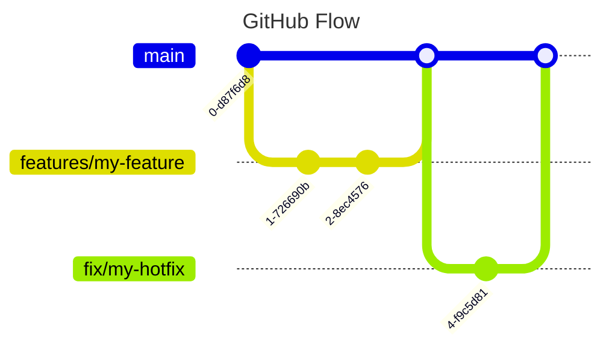

# Development Workflow

This page describes how a developer works an issue from start to finish, plus the Git, CI/CD, and deployment conventions that support it. If you only need the branching model, jump to [Git Workflow](#git-workflow).

## Implementing a New Issue

The steps below are the happy path for shipping a change. Not every step applies to every repository — the commands come in two flavors depending on the stack:

* **Frontend / UI** repos use [Bun](https://bun.sh) and are published to npm.
* **Python backend** repos use [uv](https://docs.astral.sh/uv/) and `make`, and are published to PyPI.

Both flavors are shown side by side throughout.

### 1. Pick an issue

Select an issue from the [DCC GitHub project board](https://github.com/orgs/DCC-BS/projects/4). Assign it to yourself and move it into the in-progress column so the team knows it is being worked on. If the issue is unclear, clarify it before starting.

### 2. Create a branch

Branch off `main`. Use a `feature/` prefix for new features and a `fix/` prefix for bug fixes:

```bash
git switch main
git pull
git switch -c feature/short-description   # or fix/short-description
```

Keep the branch focused and short-lived (see [Git Workflow](#git-workflow)).

### 3. Implement the change

Implement the feature or fix on your branch. Commit in logical, reviewable chunks.

### 4. Register new secrets

If your change needs a **new secret**, set it up early — you will need it to run and test locally, and the varlock schema is committed on your branch, so do this **before opening the PR**:

1. Store it in **Proton Pass** so the team has access.
2. Add it to the **[varlock env schema](./varlock.md)** so it is validated and wired up correctly.

### 5. Adjust / extend the onboarding tour (Nuxt frontend)

For changes in a Nuxt frontend, the onboarding tour needs to be adjusted or extended to match the new frontend feature set.

### 6. Format, lint, and test locally

Run the full check suite before pushing so CI does not fail on avoidable issues:

| Task   | Frontend (UI)      | Python backend |
| ------ | ------------------ | -------------- |
| Format | `bun run format`   | `make format`  |
| Lint   | `bun run lint`     | `make lint`    |
| Test   | `bun run test`     | `make test`    |
| All    | `bun run check`    | `make check`   |

### 7. Write tests

Add tests where they make sense — new logic, bug reproductions, and edge cases. Aim to cover the behavior you changed, not to hit a coverage number.

### 8. Open a pull request

Push your branch and open a pull request against `main`:

```bash
git push -u origin feature/short-description
```

### 9. Get the PR reviewed

Pull requests are reviewed by the team and by AI assistants — **[CodeRabbit](https://coderabbit.ai)** posts an automated review. Iterate on the feedback and push fixes until the review is clean. For complex or high-risk changes, ask a colleague for a human review as well.

### 10. Make CI green

The CI pipeline must pass before merging. Fix any failing checks (see [GitHub CI/CD](#github-ci-cd)).

### 11. Bump the version

Bump the version yourself following [Semantic Versioning](https://semver.org) — `major` for breaking changes, `minor` for new backward-compatible features, `patch` for backward-compatible fixes:

| Stack           | Command                                          |
| --------------- | ------------------------------------------------ |
| Frontend (UI)   | `npm version minor` &nbsp;(or `patch` / `major`) |
| Python backend  | `uv version --bump minor` &nbsp;(or `patch` / `major`) |

Push the new version (and its tag) so the release workflows can pick it up:

```bash
git push --follow-tags
```

### 12. Write a changelog entry (UI repos)

For **UI code bases**, add a changelog entry so users see what changed. Follow the [How to write changelogs](../howto/changelogs.md) guide.

### 13. Update the documentation (while the PR is open)

Keep this documentation site in sync. Comment [`/documentation`](./ai-coding.md#_2-the-documentation-comment-command) on your source PR to have the documentation bot open (or update) a matching docs PR. See [LLM Documentation Auto-Update](#llm-documentation-auto-update-documentation) for details.

::: warning Must run before you merge
The documentation bot only works from an **open** pull request. Trigger `/documentation` while your PR is still open — once the PR is merged you can no longer use it, and follow-up `/documentation` comments iterate on the same docs PR.
:::

### 14. Merge the PR

Once the review is clean, CI is green, the version is bumped, and the documentation PR is in flight, merge the pull request into `main`.

### 15. Publish the package or container

Release using the [CI reusable workflows](#reusable-workflows):

* **Frontend (UI):** publish the npm package, or build and publish the Docker image.
* **Python backend:** publish the PyPI package, or build and publish the Docker image.

The publishing workflows live in [`DCC-BS/ci-workflows`](https://github.com/DCC-BS/ci-workflows) — see [Reusable Workflows](#reusable-workflows).

### 16. Deploy to Kubernetes

Deploy the new version by updating the Helm chart (bump the image tag / chart version) in the Helm chart repository on **GitHub Enterprise**. This rolls out the change to the cluster.

---

## Checklist

Copy this into your PR description so nothing gets forgotten:

```markdown
- [ ] Picked an issue from the project board and assigned myself
- [ ] Created a `feature/` or `fix/` branch off `main`
- [ ] Implemented the change
- [ ] Stored any new secrets in Proton Pass and added them to the varlock schema
- [ ] Adjusted / extended the onboarding tour (Nuxt frontend changes only)
- [ ] Ran format / lint / test locally and everything passes
- [ ] Added tests where suitable
- [ ] Opened a PR against `main`
- [ ] Addressed CodeRabbit review (and colleague review for complex changes)
- [ ] CI is green
- [ ] Bumped the version (SemVer)
- [ ] Added a changelog entry (UI repos)
- [ ] Updated the documentation via `/documentation` (while the PR is open)
- [ ] Merged the PR
- [ ] Published the npm / PyPI package or Docker image
- [ ] Deployed via Helm chart on GitHub Enterprise
```

---

# Git Workflow
We use the [GitHub Flow](https://docs.github.com/de/get-started/using-github/github-flow) for our Git workflow. This is a simple and effective workflow for small teams and projects.

With the GitHub Flow, we have a single main branch called `main` and a feature branch for each feature or bug fix.
The lifetime of a feature branch is as short as possible.
The general workflow is as follows:

* Create a new feature branch from `main`
* Every change that is worked on is branched off the `main` branch
* Once the change is ready, it is merged into the `main` branch
* Perform a pull request to merge the feature branch into the `main` branch
* The pull request is reviewed by the team and AI assistants
* Once review is complete, fixes are applied and the CI / CD pipeline is successful we can merge the feature branch into the `main` branch
* This should trigger a release to production immediately
* Hotfixes are treated like features



# GitHub CI/CD

We use GitHub Actions for our CI/CD pipeline.
The pipeline is triggered by a push to the `main` branch and on pull requests to the `main` branch.

AI code reviews are performed by the Gemini and Code Rabbit.

## Security

To prevent tag overwrite supply chain attacks, we only use the full SHA hash to pin GitHub Actions workflows.

```yaml
# Good
uses: actions/checkout@a5ac7e51b41094c92402da3b24376905380afc29 # v4.1.6

# Bad
uses: actions/checkout@v4
```

## Reusable Workflows

Common CI/CD logic lives in the [`DCC-BS/ci-workflows`](https://github.com/DCC-BS/ci-workflows) repository as **reusable workflows** and composite actions (frontend build & test, Python backend checks, Docker/npm publishing, version bumping, and the documentation auto-updater). Consume them with `uses:` and pin to the current major tag so you receive compatible updates:

```yaml
jobs:
  ci:
    uses: DCC-BS/ci-workflows/.github/workflows/frontend-ci.yml@v9
```

See the [ci-workflows README](https://github.com/DCC-BS/ci-workflows#readme) for the full list of workflows, inputs, and secrets.

## LLM Documentation Auto-Update (`/documentation`)

Code changes and documentation drift apart. To keep the [documentation site](https://github.com/DCC-BS/documentation) in sync, any DCC repository can opt into the `/documentation` PR command, backed by the `llm-doc-update` workflow in `ci-workflows`.

**How to use it (as a developer):**

* Comment `/documentation` on a pull request that contains code changes.
* Optionally append free-text instructions in quotes to steer the update:
  ```text
  /documentation "Make sure the documentation reflects the updated API."
  ```
* The workflow analyses the PR diff against the existing docs with an LLM, opens (or updates) a **single** documentation PR for your source PR, and comments back on your PR with a summary of the changes (and any clarifying questions) plus a link to that documentation PR.
* Follow-up `/documentation` comments refine the **same** documentation PR, so you can iterate by answering its questions in further comments.

**Authentication (GitHub App):** The workflow mints a short-lived [GitHub App](https://github.com/apps) installation token scoped to exactly the source and documentation repositories. For DCC-BS this is preconfigured at the **organization** level — the App private key is the org secret `APP_PRIVATE_KEY` and the App ID is the org variable `DOC_APP_ID`. The source and documentation repos must share the same owner/org, and the App must be installed on both.

**Enabling it in a new repo:** Add a trigger workflow at `.github/workflows/llm-doc-update-trigger.yml` that calls the shared conditional workflow:

```yaml
name: LLM Doc Update Trigger

on:
  issue_comment:
    types: [created]

jobs:
  llm-doc-update:
    # Only run on PR comments starting with /documentation, from org members/owners.
    if: >
      github.event.issue.pull_request &&
      startsWith(github.event.comment.body, '/documentation') &&
      (github.event.comment.author_association == 'OWNER' || github.event.comment.author_association == 'MEMBER')
    uses: DCC-BS/ci-workflows/.github/workflows/llm-doc-update-conditional.yml@main
    with:
      doc_repo: "DCC-BS/documentation"
      doc_path: "markdown"
      pr_number: ${{ github.event.issue.number }}
      app_id: ${{ vars.DOC_APP_ID }}
    secrets:
      OPENAI_API_KEY: ${{ secrets.OPENAI_API_KEY }}
      APP_PRIVATE_KEY: ${{ secrets.APP_PRIVATE_KEY }}
```

The shared workflow handles parsing the comment (including the optional custom instructions) and reporting back. `OPENAI_API_KEY`, `APP_PRIVATE_KEY`, and `DOC_APP_ID` are available as organization secrets/variables, so no per-repo secret setup is required.


# GitHub Deployment

Deployments run on a Kubernetes cluster driven by **Helm charts** kept in a private repository on **GitHub Enterprise**. To deploy a new version, update the chart (bump the image tag / chart version) in that repository. Make sure any new secrets are stored in **Proton Pass** and declared in the [varlock env schema](./varlock.md) before rolling out.
