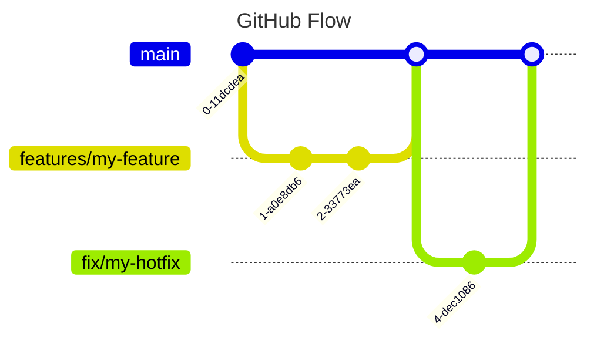

# Git Workflow
We use the [GitHub Flow](https://docs.github.com/de/get-started/using-github/github-flow) for our Git workflow. This is a simple and effective workflow for small teams and projects.

With the GitHub Flow, we have a single main branch called `main` and a feature branch for each feature or bug fix.
The lifetime of a feature branch is as short as possible.
The general workflow is as follows:

* Create a new feature branch from `main`
* Every change that is worked on is branched off the `main` branch
* Once the change is ready, it is merged into the `main` branch
* Perform a pull request to merge the feature branch into the `main` branch
* The pull request is reviewed by the team and AI assistants
* Once review is complete, fixes are applied and the CI / CD pipeline is successful we can merge the feature branch into the `main` branch
* This should trigger a release to production immediately
* Hotfixes are treated like features



# GitHub CI/CD

We use GitHub Actions for our CI/CD pipeline.
The pipeline is triggered by a push to the `main` branch and on pull requests to the `main` branch.

AI code reviews are performed by the Gemini and Code Rabbit.

## Security

To prevent tag overwrite supply chain attacks, we only use the full SHA hash to pin GitHub Actions workflows.

```yaml
# Good
uses: actions/checkout@a5ac7e51b41094c92402da3b24376905380afc29 # v4.1.6

# Bad
uses: actions/checkout@v4
```

## Reusable Workflows

Common CI/CD logic lives in the [`DCC-BS/ci-workflows`](https://github.com/DCC-BS/ci-workflows) repository as **reusable workflows** and composite actions (frontend build & test, Python backend checks, Docker/npm publishing, version bumping, and the documentation auto-updater). Consume them with `uses:` and pin to the current major tag so you receive compatible updates:

```yaml
jobs:
  ci:
    uses: DCC-BS/ci-workflows/.github/workflows/frontend-ci.yml@v9
```

See the [ci-workflows README](https://github.com/DCC-BS/ci-workflows#readme) for the full list of workflows, inputs, and secrets.

## LLM Documentation Auto-Update (`/documentation`)

Code changes and documentation drift apart. To keep the [documentation site](https://github.com/DCC-BS/documentation) in sync, any DCC repository can opt into the `/documentation` PR command, backed by the `llm-doc-update` workflow in `ci-workflows`.

**How to use it (as a developer):**

* Comment `/documentation` on a pull request that contains code changes.
* Optionally append free-text instructions in quotes to steer the update:
  ```text
  /documentation "Make sure the documentation reflects the updated API."
  ```
* The workflow analyses the PR diff against the existing docs with an LLM, opens (or updates) a **single** documentation PR for your source PR, and comments back on your PR with a summary of the changes (and any clarifying questions) plus a link to that documentation PR.
* Follow-up `/documentation` comments refine the **same** documentation PR, so you can iterate by answering its questions in further comments.

**Authentication (GitHub App):** The workflow mints a short-lived [GitHub App](https://github.com/apps) installation token scoped to exactly the source and documentation repositories. For DCC-BS this is preconfigured at the **organization** level — the App private key is the org secret `APP_PRIVATE_KEY` and the App ID is the org variable `DOC_APP_ID`. The source and documentation repos must share the same owner/org, and the App must be installed on both.

**Enabling it in a new repo:** Add a trigger workflow at `.github/workflows/llm-doc-update-trigger.yml` that calls the shared conditional workflow:

```yaml
name: LLM Doc Update Trigger

on:
  issue_comment:
    types: [created]

jobs:
  llm-doc-update:
    # Only run on PR comments starting with /documentation, from org members/owners.
    if: >
      github.event.issue.pull_request &&
      startsWith(github.event.comment.body, '/documentation') &&
      (github.event.comment.author_association == 'OWNER' || github.event.comment.author_association == 'MEMBER')
    uses: DCC-BS/ci-workflows/.github/workflows/llm-doc-update-conditional.yml@main
    with:
      doc_repo: "DCC-BS/documentation"
      doc_path: "markdown"
      pr_number: ${{ github.event.issue.number }}
      app_id: ${{ vars.DOC_APP_ID }}
    secrets:
      OPENAI_API_KEY: ${{ secrets.OPENAI_API_KEY }}
      APP_PRIVATE_KEY: ${{ secrets.APP_PRIVATE_KEY }}
```

The shared workflow handles parsing the comment (including the optional custom instructions) and reporting back. `OPENAI_API_KEY`, `APP_PRIVATE_KEY`, and `DOC_APP_ID` are available as organization secrets/variables, so no per-repo secret setup is required.


# GitHub Deployment
Private Repo on GitHub Enterprise
