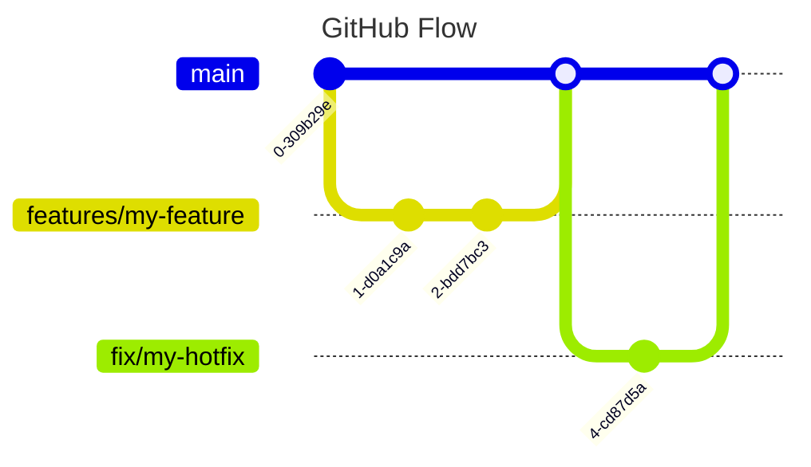

# Git Workflow
We use the [GitHub Flow](https://docs.github.com/de/get-started/using-github/github-flow) for our Git workflow. This is a simple and effective workflow for small teams and projects.

With the GitHub Flow, we have a single main branch called `main` and a feature branch for each feature or bug fix.
The lifetime of a feature branch is as short as possible.
The general workflow is as follows:

* Create a new feature branch from `main`
* Every change that is worked on is branched off the `main` branch
* Once the change is ready, it is merged into the `main` branch
* Perform a pull request to merge the feature branch into the `main` branch
* The pull request is reviewed by the team and AI assistants
* Once review is complete, fixes are applied and the CI / CD pipeline is successful we can merge the feature branch into the `main` branch
* This should trigger a release to production immediately
* Hotfixes are treated like features

# GitHub CI/CD

# GitHub Deployment
Private Repo on GitHub Enterprise