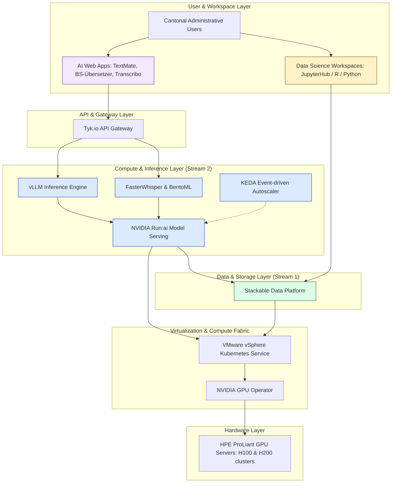

# AI & Data Infrastructure

Welcome to the documentation for the **Kantonale Daten- und KI-Plattform (KDKP)** — the sovereign data and AI hosting infrastructure of the Canton of Basel-Stadt. 

This section provides externals and developers with a high-level, non-sensitive overview of the hardware, software, and operational methodologies we use to deploy, host, and scale artificial intelligence models and data analytics platforms within a secure public sector environment.

---

## The Vision: Sovereign, Secure, and Private

In the public sector, processing citizen and administrative data demands the highest standards of confidentiality, sovereignty, and trust. Traditional cloud-based AI offerings often require sending data over the internet, risking data leaks and regulatory non-compliance. 

The Canton of Basel-Stadt has resolved this by building a state-of-the-art **on-premise Private Cloud platform**. This setup guarantees:
* **Zero External Data Leakage**: All data processing for AI applications happens entirely within the canton's own secure networks.
* **Data Sovereignty**: Complete ownership and control over data pipelines, storage, and deployed models.
* **High Security & Compliance**: Strict alignment with Swiss cantonal data protection regulations, operating in designated security zones.

---

## Collaborating for Innovation

The platform is designed and maintained as a joint initiative between two major cantonal entities:

```
┌───────────────────────────────────────┐       ┌───────────────────────────────────────┐
│     DCC Data Competence Center        │       │                 IT BS                 │
│         (Statistisches Amt)           │       │       (Central IT Provider)           │
├───────────────────────────────────────┤       ├───────────────────────────────────────┤
│ • Rapid Prototyping (core service)    │       │ • On-Premise Hardware Operations      │
│ • AI Strategy & Competence            │ <───> │ • VMware vSphere Kubernetes (VKS)     │
│ • Teaching & AI Enablement            │       │ • Security Zones & Firewall Controls  │
│ • Model Eval & Reusable Libraries     │       │ • App Operations & Productionization  │
└───────────────────────────────────────┘       └───────────────────────────────────────┘
```

* **DCC Data Competence Center** (part of the **Statistisches Amt**): Focuses on the "innovation and application" layer. The DCC's core focus is rapid prototyping (building pilots such as *TextMate*, *BS-Übersetzer*, and *Transcribo*), teaching across the canton (what AI is, how it can be used, and where it adds value), and enabling the use of AI within existing administrative processes. It also evaluates models and develops reusable frontend and backend software libraries.
* **IT BS**: Focuses on the "infrastructure and operation" layer. IT BS operates the underlying physical hardware, administers the virtualization platform (VMware vSphere Kubernetes Service), manages network zoning and firewall rules, and runs the productive applications — including taking DCC's prototypes from prototype into production. It ensures overall platform stability, reliability, and enterprise-grade SLA monitoring.

---

## Platform Architecture (The 4 Streams)

The KDKP project is structured into four core streams to offer a modular, robust environment:



### Stream 1: The Data Platform
Managed in partnership with Stackable, this stream provides a modular, open-source data platform. It gives data scientists and AI applications secure, efficient, and audited access to structured and unstructured cantonal databases.

### Stream 2: The AI Platform (GPU Compute & Inference)
This stream is the core engine for local AI. By utilizing advanced GPU hardware and container orchestration, it enables hosting massive Open-Source Large Language Models (LLMs) and other deep learning algorithms completely locally. (See the [Software Stack](/infrastructure/software) page for detail).

### Stream 3: The Collaborative Data Science Environment
Built in partnership with [b-data GmbH](https://www.b-data.io), this environment provides containerized, personal workspaces (using JupyterHub, RStudio, and Python) where data analysts from various departments can securely work together on analytics without copying data locally.

### Stream 4: AI Web Applications
This stream delivers standardized, reusable UI layers, Nuxt/Vue guidelines, and components to accelerate the deployment of user-facing AI applications (e.g., chat interfaces, RAG assistants, translation toolkits).
