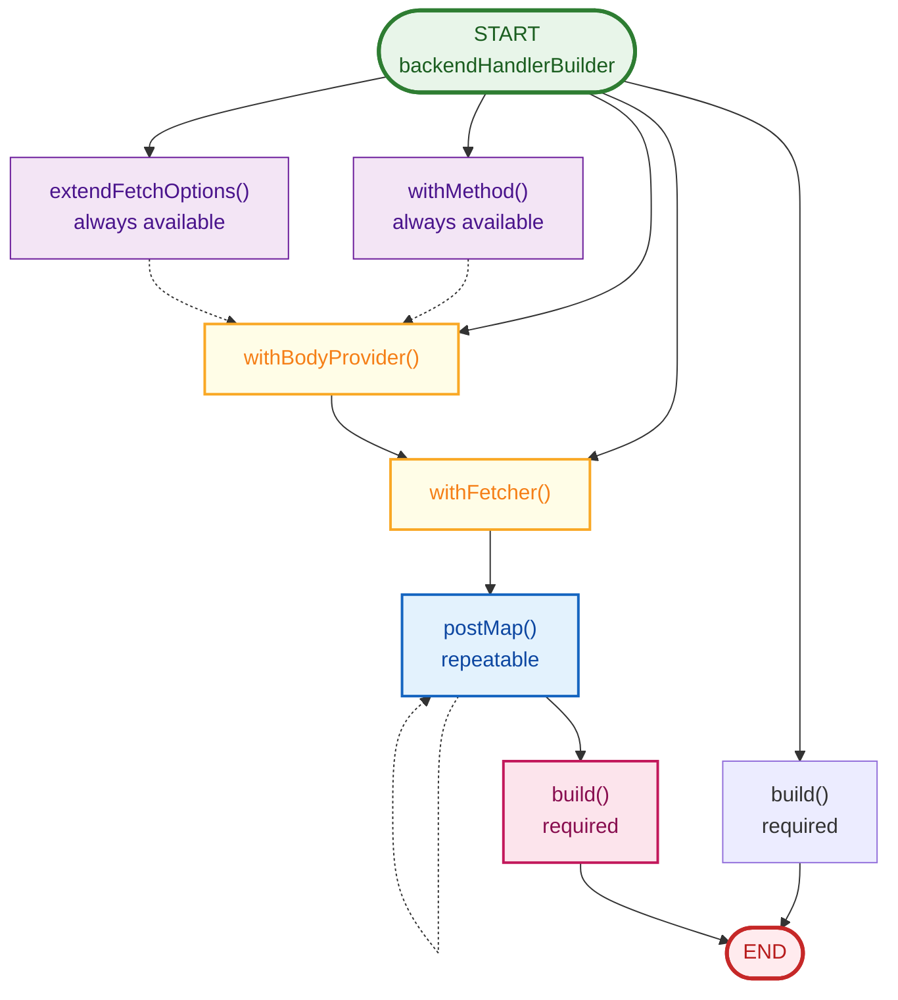

# Backend Communication Layer

The backend communication layer provides powerful utilities for building
type-safe, configurable API handlers in your Nuxt server routes. It simplifies
communication between your Nuxt application and backend APIs with a fluent
builder interface.

## Overview

The backend communication layer offers:

- 🔧 **Fluent Builder API** - Chain methods to configure your handlers
- 🔒 **Type Safety** - Full TypeScript support with automatic type inference through generics
- 🔄 **Request/Response Transformation** - Custom body providers and response transformers
- 🎯 **Flexible Fetch Options** - Extend and customize HTTP requests
- ⚡ **Error Handling** - Built-in error transformation and handling with proper HTTP status codes
- 🔌 **Integration Ready** - Works seamlessly with auth layers
- 🔑 **Method Inheritance** - Automatically inherits HTTP method from incoming requests
- 🎭 **Dummy Data Mode** - Mock API responses for development and testing

## Quick Start

### Installation

Add the layer to your `nuxt.config.ts`:

```typescript
export default defineNuxtConfig({
  extends: [
    ['github:DCC-BS/nuxt-layers/backend_communication', { install: true }]
  ]
})
```

### Basic Usage

Create a simple pass-through API handler:

```typescript
// server/api/users.get.ts
import { backendHandlerBuilder } from '#backend_communication'

export default backendHandlerBuilder()
    .build('/users')
```

This creates a handler that forwards requests to `${API_URL}/users`. By default,
it inherits the HTTP method from the incoming request (GET in this case).

## Configuration

The layer requires the following environment variables:

| Variable           | Required | Description                                    | Example                                   |
| ----------------- | -------- | ---------------------------------------------- | ----------------------------------------- |
| `API_URL`        | Yes      | Base URL of your backend API                    | `https://api.example.com`                  |
| `LOGGER_LAYER_URI` | No      | URI to logger implementation layer               | `github:DCC-BS/nuxt-layers/pino-logger`  |
| `DUMMY`          | No      | Enable dummy data mode (set to "true")         | `true` or empty string                     |

```bash
# .env
API_URL=https://api.example.com
LOGGER_LAYER_URI=github:DCC-BS/nuxt-layers/pino-logger
DUMMY=true
```

### Runtime Configuration

The backend communication layer supports the following runtime configuration options in your `nuxt.config.ts`:

```typescript
export default defineNuxtConfig({
    runtimeConfig: {
        apiUrl: process.env.API_URL,
        useDummyData: process.env.DUMMY || "",
    },
});
```

| Option       | Type    | Default | Description                                    |
| ------------ | ------- | -------- | ---------------------------------------------- |
| `apiUrl`     | string  | -        | Base URL of backend API                         |
| `useDummyData` | string | `""`    | Set to `"true"` to use dummy data fetcher instead of real backend |

When `useDummyData` is set to `"true"`, all backend handlers will use the dummy fetcher (if configured) instead of making real HTTP requests. This is useful for:
- Frontend development without a running backend
- Testing and debugging
- Offline development

## Builder API

The `backendHandlerBuilder()` provides a chainable interface for configuring handlers.
All methods return a new builder instance, making them immutable and composable.

### Immutability and Composition

Each builder method returns a **new** builder instance rather than modifying the
existing one. This makes builders immutable and allows you to create variations:

```typescript
const baseBuilder = backendHandlerBuilder()
  .extendFetchOptions(async (options) => ({
    ...options,
    headers: {
      ...options.headers,
      'X-API-Version': 'v1'
    }
  }))

// Create variations without affecting the base
const getUserHandler = baseBuilder.build('/users')
const postUserHandler = baseBuilder
  .withMethod('POST')
  .withBodyProvider(async (event) => readBody(event))
  .build('/users')
```

### Type Safety and Method Availability

The builder maintains type safety by dynamically adjusting which methods are
available based on the current builder state. This prevents invalid configurations
and ensures type correctness throughout the chain.

#### Method Availability Rules

1. **After `withBodyProvider`**: The body type changes, so `withBodyProvider` is removed
   (can't change body type again).

2. **After `withFetcher`**: The response type changes, so:
   - `withBodyProvider` is removed (can't change body type after fetcher is set)
   - `withFetcher` is removed (fetcher is already configured)

3. **After `postMap`**: The response type is transformed, so:
   - `withBodyProvider` is removed (can't change body type after transformations start)
   - `withFetcher` is removed (can't change fetcher after transformations start)

4. **`withMethod` and `extendFetchOptions`**: Always available for further configuration

```typescript
// ✅ Valid: Configure body provider, then fetcher, then transform
const handler1 = backendHandlerBuilder()
  .withBodyProvider(async (event) => ({ name: 'Test' }))
  .withFetcher(async (options) => ({ id: 1, name: options.body?.name }))
  .postMap(async (response) => ({ userId: response.id }))
  .build('/users')

// ❌ Invalid: Can't call withBodyProvider twice
// TypeScript error: withBodyProvider does not exist on type
const handler2 = backendHandlerBuilder()
  .withBodyProvider(async (event) => ({ name: 'Test' }))
  .withBodyProvider(async (event) => ({ email: 'test@example.com' })) // Error!
  .build('/users')

// ❌ Invalid: Can't call withFetcher twice
// TypeScript error: withFetcher does not exist on type
const handler3 = backendHandlerBuilder()
  .withFetcher(async (options) => ({ id: 1 }))
  .withFetcher(async (options) => ({ id: 2 })) // Error!
  .build('/users')

// ❌ Invalid: Can't call withBodyProvider after postMap
// TypeScript error: withBodyProvider does not exist on type
const handler4 = backendHandlerBuilder()
  .postMap(async (response) => ({ data: response }))
  .withBodyProvider(async (event) => ({ name: 'Test' })) // Error!
  .build('/users')

// ✅ Valid: withMethod and extendFetchOptions are always available
const handler5 = backendHandlerBuilder()
  .withBodyProvider(async (event) => ({ name: 'Test' }))
  .withFetcher(async (options) => ({ id: 1 }))
  .postMap(async (response) => ({ userId: response.id }))
  .withMethod('POST') // Still available
  .extendFetchOptions(async (options) => ({ ...options })) // Still available
  .build('/users')
```

#### Why These Restrictions Exist

These restrictions ensure type safety and prevent invalid configurations:

- **`withBodyProvider` changes `TBody`**: Once set, the body type is locked. Calling
  it again would cause type confusion in the fetcher and subsequent transformations.

- **`withFetcher` locks `TBody` and `TResponse`**: The fetcher is typed for specific
  body and response types. Changing either after setting the fetcher would break
  the type contract.

- **`postMap` transforms `TResponse`**: Once you start transforming responses, you
  can't go back and change the body provider or fetcher, as they produce the
  original response type.

This design guides you toward the correct configuration order while maintaining
full type safety throughout the builder chain. Think of it as a one-way flow:
configure inputs first, then processing, then outputs.

#### Valid Configuration Patterns



**Key points:**

- `withMethod` and `extendFetchOptions` can be called at any point (always available)
- `withBodyProvider` removes itself from availability after being called
- `withFetcher` removes both `withBodyProvider` and `withFetcher` from availability
- `postMap` removes both `withBodyProvider` and `withFetcher` from availability
- `postMap` can be chained multiple times
- `build()` must be the final call

### Execution Flow

When a handler built with `backendHandlerBuilder()` is executed, the flow is:

1. **Configuration Phase** (at build time)
   - Builder methods are chained to configure the handler
   - Each method returns a new immutable builder instance
   - Extensions are composed but not executed yet

2. **Execution Phase** (when the handler receives a request)
   - Validate `API_URL` is configured
   - Call body provider to get request body
   - Determine HTTP method (from `withMethod` or inherited)
   - Apply `extendFetchOptions` extensions in order (each wraps the previous)
   - Make HTTP request using the fetcher
   - Apply `postMap` transformations in order (each transforms the previous)
   - Return the final response or handle errors

```typescript
// This handler...
export default backendHandlerBuilder()
  .withMethod('POST')
  .withBodyProvider(async (event) => {
    const body = await readBody(event)
    return { ...body, timestamp: Date.now() }
  })
  .extendFetchOptions(async (options) => ({
    ...options,
    headers: { ...options.headers, 'X-Custom': 'value' }
  }))
  .postMap(async (response) => ({
    success: true,
    data: response
  }))
  .build('/users')

// ...executes in this order when called:
// 1. withBodyProvider: Read and transform body
// 2. extendFetchOptions: Add custom headers
// 3. Fetch: Make POST request to backend
// 4. postMap: Transform response
// 5. Return: { success: true, data: {...} }
```

### Type Parameters

The builder uses TypeScript generics to ensure type safety throughout the transformation pipeline:

```typescript
backendHandlerBuilder<TRequest, TBody, TResponse, TResponseTransformed>()
```

- `TRequest extends EventHandlerRequest` - Type of the incoming H3 event request
- `TBody` - Type of the request body sent to the backend
- `TResponse` - Type of the raw response from the backend
- `TResponseTransformed` - Type of the transformed response returned to the client

Each builder method can update these type parameters, and TypeScript will infer them automatically.

### Builder Methods

#### `withMethod(method: FetchMethodType)`

Set the HTTP method for the request. Overrides the default method inheritance.

```typescript
export default backendHandlerBuilder()
  .withMethod('POST')
  .build('/users')
```

**Parameters:**
- `method` - One of: `'INHERIT' | 'GET' | 'POST' | 'PUT' | 'DELETE' | 'PATCH' | 'HEAD' | 'OPTIONS'`

**Default**: `'INHERIT'` - Inherits from the incoming request method

#### `extendFetchOptions(fn: (options) => Promise<FetcherOptions>)`

Extend or modify fetch options before making the request. Multiple calls to
`extendFetchOptions` chain together, with each extension receiving the output
of the previous one.

```typescript
export default backendHandlerBuilder()
  .extendFetchOptions(async (options) => {
    return {
      ...options,
      headers: {
        ...options.headers,
        'X-API-Key': process.env.API_KEY,
        'X-Request-ID': generateRequestId()
      },
      // Note: ofetch options like timeout can be added here
    }
  })
  .build('/users')
```

**Parameters:**
- `fn(options)` - Receives `FetcherOptions<TBody>` containing:
  - `url` - Full URL (API_URL + path)
  - `method` - HTTP method
  - `body` - Request body
  - `headers` - Headers object
  - `event` - H3 event object
  - Returns `Promise<FetcherOptions<TBody>>` - Extended options

**Use cases:**

- Add authentication headers (done automatically by auth layers)
- Add custom headers
- Set timeouts and other ofetch options
- Configure retries
- Add query parameters to the URL

::: info Note
Extensions are chained in the order they're called. Each extension
wraps the previous one, allowing for layered configuration.
:::

#### `withBodyProvider(fn: (event) => Promise<TNewBody>)`

Configure a custom function to provide the request body. The body provider
receives the H3 event and returns the body to send to the backend. This allows
you to read, transform, and completely change the body type.

```typescript
export default backendHandlerBuilder()
  .withMethod('POST')
  .withBodyProvider(async (event) => {
    const body = await readBody(event)
    return {
      ...body,
      processedAt: new Date().toISOString(),
      source: 'api-gateway'
    }
  })
  .build('/users')
```

**Parameters:**
- `fn(event)` - A function that receives the H3 event and returns the body
  - `event` - H3 event object
  - Returns `Promise<TNewBody>` - The body to send (can transform the type)

**Use cases:**

- Read and prepare the request body for POST/PUT requests
- Transform request data structure
- Add computed fields to requests
- Validate and sanitize input
- Convert between API versions
- Add metadata to requests
- Extract body from different sources (cookies, headers, etc.)

::: tip Note
This is primarily used for POST/PUT/PATCH requests where you need to
read and transform the request body. The default body provider returns `undefined`
for GET requests.
:::

**Important:** Calling `withBodyProvider` removes `withFetcher` from subsequent
calls because the body type has changed and the fetcher must match the new body type.

#### `withFetcher<TNewResponse>(fn: Fetcher<TBody, TNewResponse>)`

Configure a custom fetch implementation for making HTTP requests. This replaces
the default `ofetch`-based fetcher with your own implementation.

```typescript
export default backendHandlerBuilder()
  .withFetcher(async (options) => {
    // Custom fetch logic with retry, logging, etc.
    return customFetch(options.url, options)
  })
  .build('/users')
```

**Parameters:**
- `fn(options)` - A fetcher function that receives `FetcherOptions<TBody>`
  - Returns `Promise<TNewResponse>` - The response from your custom fetcher

**Use cases:**

- Implement custom retry logic
- Add request/response logging
- Integrate with external HTTP clients (axios, node-fetch, etc.)
- Implement circuit breaker patterns
- Add request caching
- Mock responses for testing

::: info Note
Using a custom fetcher changes the response type, which:

- Removes `withBodyProvider` from subsequent calls (body type is locked)
- Removes `withFetcher` from subsequent calls (fetcher is already set)
:::

#### `withDummyFetcher<TNewResponse extends TResponse = TResponse>(dummyData: DummyFetcherData<TBody, TNewResponse>)`

Configure a dummy fetcher that returns mock data instead of making real HTTP requests. This is useful for development and testing when you don't have a backend available.

**Parameters:**
- `dummyData` - Can be:
  - **Static value**: A value or object to return directly
  - **Function**: A function that receives `FetcherOptions<TBody>` and returns mock data

::: info Note
`withDummyFetcher` does not change the response type - it uses the type from `withFetcher`. If you need to change the response type, use `withFetcher<TNewResponseType>()` instead.
:::

**Use cases:**

- Frontend development without backend
- Mock API responses for testing
- Demo/prototype development
- Integration testing with predictable responses

**Static dummy data:**

```typescript
export default backendHandlerBuilder()
  .withDummyFetcher({
    id: 1,
    name: "Test User",
    email: "test@example.com"
  })
  .build('/users')
```

**Dynamic dummy data:**

```typescript
export default backendHandlerBuilder()
  .withDummyFetcher((options) => {
    return {
      url: options.url,
      method: options.method,
      data: {
        mock: true,
        timestamp: Date.now()
      }
    }
  })
  .build('/users')
```

**Combined with real fetcher:**

```typescript
export default backendHandlerBuilder()
  .withFetcher(async (options) => {
    // Real fetcher for production
    return await $fetch(options.url, options)
  })
  .withDummyFetcher({
    // Fallback dummy data for development
    mock: true,
    data: []
  })
  .build('/users')
```

::: info Note
Using `withDummyFetcher` removes the following methods from subsequent calls:
- `withBodyProvider` (body type is locked)
- `withFetcher` (fetcher is already configured)
- `withDummyFetcher` (dummy fetcher is already configured)
:::

#### `postMap<TMap>(fn: (response) => Promise<TMap>)`

Transform the response from the backend before returning to the client. Multiple
`postMap` calls chain together, with each transformation receiving the output
of the previous one.

```typescript
export default backendHandlerBuilder()
  .postMap(async (response) => {
    return {
      data: response.items,
      count: response.items.length,
      processedAt: new Date().toISOString()
    }
  })
  .build('/users')
```

**Parameters:**
- `fn(response)` - A transformer function
  - `response` - The response from the previous transformation or fetcher
  - Returns `Promise<TMap>` - The transformed response

**Use cases:**

- Normalize response format
- Add computed fields
- Filter sensitive data
- Transform data structure
- Enrich responses with additional data
- Format dates and numbers

::: info Note
Transformations are chained in order. Each `postMap` receives the
output of the previous one, allowing for layered transformations.
:::

**Important:** Once you call `postMap`, both `withBodyProvider` and `withFetcher`
are removed from availability because transformations are tied to the response type
produced by the current fetcher configuration.

#### `build(path: string): EventHandler`

Build and return the configured event handler. Must be called last in the
builder chain.

```typescript
export default backendHandlerBuilder()
  .withMethod('GET')
  .build('/users')
```

**Parameters:**
- `path` - The backend API endpoint path (relative to `API_URL`)

**Returns:**
- `EventHandler<TRequest, Promise<TResponseTransformed>>` - A H3 event handler
  that can be exported from your server route file

**Behavior:**
1. Validates that `API_URL` is configured in runtime config
2. Calls the body provider to get the request body
3. Determines the HTTP method (from `withMethod` or inherited from request)
4. Applies all `extendFetchOptions` extensions
5. Makes the request using the configured fetcher
6. Applies all `postMap` transformations
7. Handles errors and converts them to proper HTTP error responses

## Common Patterns

### Pass-Through Handler

The simplest pattern - forward requests directly:

```typescript
// server/api/data.get.ts
export default backendHandlerBuilder()
  .build('/data')
```

Request to `/api/data` → Forwards to `${API_URL}/data`

### POST with Body Transformation

Transform the request before sending:

```typescript
// server/api/users.post.ts
export default backendHandlerBuilder()
  .withMethod('POST')
  .withBodyProvider(async (event) => {
    const body = await readBody(event)
    return {
      firstName: body.first_name,
      lastName: body.last_name,
      email: body.email.toLowerCase(),
      createdAt: new Date().toISOString()
    }
  })
  .build('/users')
```

### Response Normalization

Standardize response format:

```typescript
// server/api/users.get.ts
export default backendHandlerBuilder()
  .postMap(async (response) => {
    return {
      success: true,
      data: response,
      meta: {
        timestamp: Date.now(),
        version: '1.0'
      }
    }
  })
  .build('/users')
```

### Custom Headers and Timeout

Add custom headers and configure timeout:

```typescript
// server/api/external.get.ts
export default backendHandlerBuilder()
  .extendFetchOptions(async (options) => {
    return {
      ...options,
      headers: {
        ...options.headers,
        'X-API-Key': process.env.EXTERNAL_API_KEY!,
        'Accept': 'application/json'
      },
      // ofetch timeout option (in milliseconds)
      timeout: 10000
    }
  })
  .build('/external/data')
```

### Combined Transformations

Use multiple transformations together:

```typescript
// server/api/orders.post.ts
export default backendHandlerBuilder()
  .withMethod('POST')
  .withBodyProvider(async (event) => {
    const body = await readBody(event)
    // Validate and transform request
    return {
      ...body,
      orderId: generateOrderId(),
      timestamp: Date.now()
    }
  })
  .extendFetchOptions(async (options) => {
    // Add custom headers
    return {
      ...options,
      headers: {
        ...options.headers,
        'X-Idempotency-Key': generateIdempotencyKey()
      }
    }
  })
  .postMap(async (response) => {
    // Transform response
    return {
      success: true,
      order: response,
      confirmationUrl: generateConfirmationUrl(response.id)
    }
  })
  .build('/orders')
```

## Integration with Auth Layer

::: tip Logger Integration
The backend communication layer extends [logger layer](./logger.md) for logging. You can configure logging implementation using the `LOGGER_LAYER_URI` environment variable.
:::

When used with the [auth layer](./auth.md), the authentication implementation
automatically extends the backend handler to add authentication headers using
`extendFetchOptions`.

### Azure Auth Integration

With `azure-auth`, the `authHandler` automatically adds the Bearer token:

```typescript
// server/api/protected.get.ts
import { authHandler } from '#auth'

export default authHandler.build('/protected-data')
```

This is equivalent to:

```typescript
import { backendHandlerBuilder } from '#backend_communication'

export default backendHandlerBuilder()
  .extendFetchOptions(async (options) => {
    const token = await getTokenFromSession(options.event)
    return {
      ...options,
      headers: {
        ...options.headers,
        'Authorization': `Bearer ${token}`
      }
    }
  })
  .build('/protected-data')
```

### No Auth Integration

With `no-auth`, the `authHandler` is a simple pass-through:

```typescript
// Same code works without authentication in dev mode
export default authHandler.build('/data')
```

## Using Dummy Data Mode

The backend communication layer supports dummy data mode for development and testing. When enabled, handlers use mock data instead of making real HTTP requests.

### Enabling Dummy Data Mode

Set to `DUMMY` environment variable to `"true"`:

```bash
# .env
DUMMY=true
API_URL=http://localhost:8000
```

Or configure in `nuxt.config.ts`:

```typescript
export default defineNuxtConfig({
    runtimeConfig: {
        useDummyData: "true",
        apiUrl: process.env.API_URL,
    },
});
```

### How It Works

When `useDummyData` is set to `"true"`:

1. **With dummy fetcher configured**: Uses the mock data from `withDummyFetcher()`
2. **Without dummy fetcher configured**: Throws an error requiring you to provide dummy data

### Example: Testing Without Backend

```typescript
// server/api/test.get.ts
export default backendHandlerBuilder()
    .withDummyFetcher({
        users: [
            { id: 1, name: "Alice" },
            { id: 2, name: "Bob" }
        ]
    })
    .build('/users')

// When DUMMY=true: Returns mock data
// When DUMMY=false: Makes real request to API_URL/users
```

### Example: Dynamic Dummy Data

```typescript
// server/api/test2.get.ts
export default backendHandlerBuilder()
    .withDummyFetcher((options) => {
        return {
            url: options.url,
            method: options.method,
            mock: true,
        }
    })
    .build('/some/path')

// Returns dynamic response based on request options
```

## Error Handling

The builder includes comprehensive built-in error handling that transforms
backend errors into proper HTTP error responses with appropriate status codes.

### Automatic Error Handling

All handlers automatically handle:

- **Network errors** - Connection failures, DNS errors
- **HTTP error status codes** - 4xx and 5xx responses from backend
- **Timeout errors** - Request timeouts
- **Invalid responses** - Malformed or unexpected responses
- **Error objects with statusCode** - Preserves original error structure

The error handler:

1. Extracts error message from strings or Error objects
2. Preserves `statusCode` and `statusMessage` from error objects
3. Wraps errors in a consistent format using H3's `createError`
4. Includes the original error in the `data` field for debugging

```typescript
// No additional error handling needed - it's automatic
export default backendHandlerBuilder()
  .build('/users')
```

### Error Response Format

Errors are returned in this format:

```typescript
{
  statusCode: number,      // HTTP status code
  statusMessage: string,   // HTTP status message
  message: string,         // Error message
  data: {
    originalError: unknown // The original error for debugging
  }
}
```

### Custom Error Handling

While the built-in error handling is comprehensive, you can add custom logic
by wrapping the handler:

```typescript
import { backendHandlerBuilder } from '#backend_communication'
import { createError } from 'h3'

const handler = backendHandlerBuilder()
  .build('/users')

export default defineEventHandler(async (event) => {
  try {
    return await handler(event)
  } catch (error) {
    // Custom error transformation
    if (isSpecificError(error)) {
      throw createError({
        statusCode: 422,
        message: 'Custom validation error'
      })
    }
    throw error // Re-throw for default handling
  }
})
```

## Advanced Usage

### Dynamic Path Construction

Build paths dynamically based on request:

```typescript
// server/api/users/[id].get.ts
import { backendHandlerBuilder } from '#backend_communication'

export default defineEventHandler(async (event) => {
  const id = getRouterParam(event, 'id')
  
  const handler = backendHandlerBuilder()
    .build(`/users/${id}`)
  
  return handler(event)
})
```

### Conditional Transformations

Apply transformations based on conditions:

```typescript
export default backendHandlerBuilder()
  .withBodyProvider(async (event) => {
    const body = await readBody(event)
    const query = getQuery(event)
    
    // Different transformation based on query param
    if (query.format === 'minimal') {
      return { id: body.id, name: body.name }
    }
    
    return body
  })
  .build('/users')
```

### Request Validation

Validate requests before forwarding:

```typescript
import { z } from 'zod'

const userSchema = z.object({
  email: z.string().email(),
  name: z.string().min(2),
  age: z.number().min(18)
})

export default backendHandlerBuilder()
  .withMethod('POST')
  .withBodyProvider(async (event) => {
    const body = await readBody(event)
    
    // Validate with Zod
    const validated = userSchema.parse(body)
    
    return validated
  })
  .build('/users')
```

### Response Caching

Add caching to responses:

```typescript
const cache = new Map()

export default backendHandlerBuilder()
  .postMap(async (response) => {
    const cacheKey = JSON.stringify(response)
    cache.set(cacheKey, {
      data: response,
      timestamp: Date.now()
    })
    return response
  })
  .build('/users')
```

### Retry Logic

Implement retry logic with extended fetch options:

```typescript
export default backendHandlerBuilder()
  .extendFetchOptions(async (options) => {
    return {
      ...options,
      retry: 3,
      retryDelay: 1000,
      onRetry: ({ attempt, error }) => {
        console.log(`Retry attempt ${attempt}: ${error.message}`)
      }
    }
  })
  .build('/users')
```

## Type Safety

The builder uses TypeScript generics to provide full type safety throughout the
transformation pipeline. Types are automatically inferred as you chain methods.

### Automatic Type Inference

TypeScript automatically tracks types through each transformation:

```typescript
// TypeScript knows:
// - TBody = { name: string }
// - TResponse = { id: number, name: string } (from backend)
// - TResponseTransformed = { data: User[], count: number }

export default backendHandlerBuilder()
  .withBodyProvider(async () => ({ name: 'Test' }))
  .postMap(async (response) => ({
    data: response.items,
    count: response.items.length
  }))
  .build('/users')
```

### Explicit Type Annotations

You can also specify types explicitly for better documentation and tooling:

```typescript
interface User {
  id: number
  name: string
  email: string
}

interface CreateUserRequest {
  name: string
  email: string
}

interface UserResponse {
  users: User[]
  total: number
}

interface NormalizedResponse {
  data: User[]
  count: number
  hasMore: boolean
}

export default backendHandlerBuilder()
  .withBodyProvider<CreateUserRequest>(async (event) => {
    const body = await readBody(event)
    return { name: body.name, email: body.email }
  })
  .postMap<NormalizedResponse>(async (response: UserResponse) => {
    return {
      data: response.users,
      count: response.total,
      hasMore: response.total > response.users.length
    }
  })
  .build('/users')
```

### Type Safety Benefits

- **Catch errors at compile time** - Invalid transformations are caught before runtime
- **Better autocomplete** - IDE knows the shape of your data at each step
- **Self-documenting** - Types serve as inline documentation
- **Refactor confidently** - Changes to types propagate through the chain

## Performance Considerations

### Minimize Transformations

Only transform data when necessary:

```typescript
// ❌ Unnecessary transformation
export default backendHandlerBuilder()
  .postMap(async (response) => response) // No-op
  .build('/users')

// ✅ Direct pass-through
export default backendHandlerBuilder()
  .build('/users')
```

### Async Operations

Use async operations efficiently:

```typescript
export default backendHandlerBuilder()
  .withBodyProvider(async (event) => {
    const [body, session] = await Promise.all([
      readBody(event),
      getSession(event)
    ])
    return { ...body, userId: session.user.id }
  })
  .build('/users')
```

### Streaming Large Responses

For large responses, avoid transformations that load entire response:

```typescript
// For large files/data, use direct pass-through
export default backendHandlerBuilder()
  .build('/large-file')
```

## Best Practices

### 1. Use Descriptive File Names

```txt
server/api/
  ├── users/
  │   ├── index.get.ts      # GET /api/users
  │   ├── index.post.ts     # POST /api/users
  │   └── [id].get.ts       # GET /api/users/:id
  └── orders/
      └── index.get.ts      # GET /api/orders
```

### 2. Keep Transformations Simple

```typescript
// ✅ Good - single responsibility
export default backendHandlerBuilder()
  .withBodyProvider(async (event) => addTimestamp(await readBody(event)))
  .build('/users')

// ❌ Bad - too much logic
export default backendHandlerBuilder()
  .withBodyProvider(async (event) => {
    // 50 lines of complex logic
  })
  .build('/users')
```

### 3. Reuse Common Transformations

```typescript
// utils/transformations.ts
export const addTimestamp = (body: any) => ({
  ...body,
  timestamp: Date.now()
})

export const normalizeResponse = (response: any) => ({
  success: true,
  data: response
})

// server/api/users.post.ts
export default backendHandlerBuilder()
  .withBodyProvider(async (event) => 
    addTimestamp(await readBody(event))
  )
  .postMap(normalizeResponse)
  .build('/users')
```

### 4. Document Your Handlers

```typescript
/**
 * Creates a new user
 * 
 * Transforms request to add timestamp and source
 * Returns normalized response with user data
 */
export default backendHandlerBuilder()
  .withMethod('POST')
  .withBodyProvider(async (event) => {
    const body = await readBody(event)
    return { ...body, timestamp: Date.now() }
  })
  .build('/users')
```

### 5. Handle Errors Appropriately

The built-in error handling is comprehensive, but you should still validate
inputs early:

```typescript
import { z } from 'zod'

const schema = z.object({
  email: z.string().email(),
  name: z.string().min(2)
})

export default backendHandlerBuilder()
  .withMethod('POST')
  .withBodyProvider(async (event) => {
    const body = await readBody(event)
    // Validate before sending to backend
    return schema.parse(body)
  })
  .build('/users')
```

## Related Documentation

- [Auth Layer](./auth.md) - Authentication integration
- [Health Check Layer](./health_check.md) - Monitoring endpoints
- [Nuxt Layers Overview](./index.md) - Main documentation
